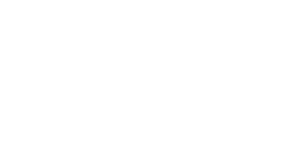
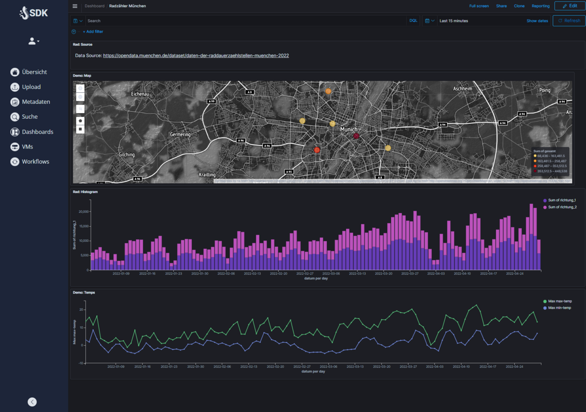
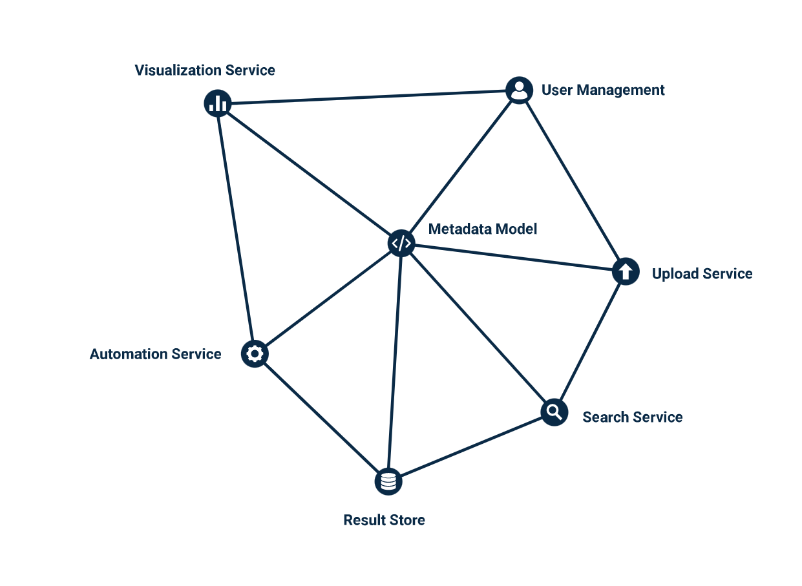

    

    <em>A data platform for everyone</em>

 
 
 

# SUPERB DATA KRAKEN

**An automated data platform to capture, process, analyze and present your data**

From your data to your insights in interactive dashboards within minutes. Automation of knowledge extraction through customizable workflows.  
SDK is more than just a business intelligence platform as a data platform. Reacquaint yourself with your company's data and learn how to leverage it further!
 
 
 

 
 

# How does it work?

SDK is divided into different components that can be combined according to your preferences. It all starts with data upload.  
In this process, data is processed through a secure area and transferred to the desired storage location.

During the upload, metadata is captured and processed in a search engine. If needed, this data can be made fully searchable based on content.  
Automated analysis takes place through workflows, which can be generated and customized as per requirements and preferences.

The results are then stored in appropriate databases and visualized through interactive dashboards. Users can access the data and the insights  
derived from it. Of course, access permissions can be managed and personalized by the admin at any time.
 
 
 

 
 

# What is beyond your data?

Everyone has the feeling of knowing their company's data and consequently makes decisions based on this feeling. It would be better to bring  
the data together and analyze it to turn feelings into facts and let them speak. We're here to help you build the infrastructure for your data.  
The goal is to generate knowledge from corporate data using custom processing pipelines. Make company decisions based on facts and lead your  
business into a successful and sustainable future with a data strategy.
